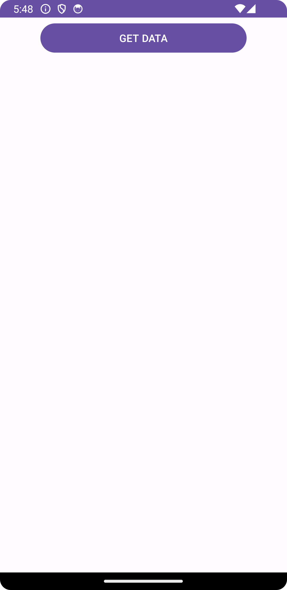

# Fetch Hiring Data Android App

An Android app written in Java that retrieves data from [https://fetch-hiring.s3.amazonaws.com/hiring.json](https://fetch-hiring.s3.amazonaws.com/hiring.json) and displays it to the user with the following features:

- Retrieves and parses data from a specific URL using OkHttpClient.
- Groups the data by "listId."
- Sorts the results first by "listId" and then by "name" when displaying.
- Filters out any items where "name" is blank or null.
- Presents the final result in a cardview
- Follows advanced Object-Oriented Design (OOD) principles like SOLID, including Dependency Inversion (abstracting the item class to an interface).
- Includes robust testing using Android Test and JUnit Test, with thread safety ensured using CountDownLatch.

## Table of Contents

- [Introduction](#introduction)
- [Features](#features)
- [Screenshots](#screenshots)
- [Installation](#installation)
- [Update](#update)
- [Usage](#usage)
- [Contributing](#contributing)
- [License](#license)

## Introduction

This Android app is designed to fetch data from a remote JSON source and display it in an organized and user-friendly manner. It follows specific requirements to ensure the data is grouped, sorted, and filtered appropriately. Additionally, it adopts advanced Object-Oriented Design principles, including Dependency Inversion, to maintain code quality and modularity.

## Features

- Retrieves and parses data from a specific URL using OkHttpClient.
- Groups items by "listId."
- Sorts items by "listId" and then by "name."
- Filters out items with blank or null "name" values.
- Presents the final result in a cardview.
- Follows advanced Object-Oriented Design (OOD) principles like SOLID and Dependency Inversion.
- Includes robust testing using Android Test and JUnit Test, with thread safety ensured using CountDownLatch.

## Screenshots


*When user click GET DATA button, it will fetch and show the data*



*Initially, this app does not show any data until the user clicks the get data button.*


*When the user clicks the button, data will show up.*

## Installation

To install and run the app, follow these steps:

1. Clone the repository:
   ```bash
   git clone https://github.com/LuyaoWang123/fetchAndroid.git

2. Choose a branch:

   1.1 main: implement by singleton

   1.2 mvvm: implement by mvvm

## Update

In the **mvvm** branch, this app implements the viewmodel to fix the bug caused by lifecycle problem, specically, when user rotates the phone, the data will disappear.

While in the **main** branch, this app implements the singleton to fix the bug caused by lifecycle problem, as described above.